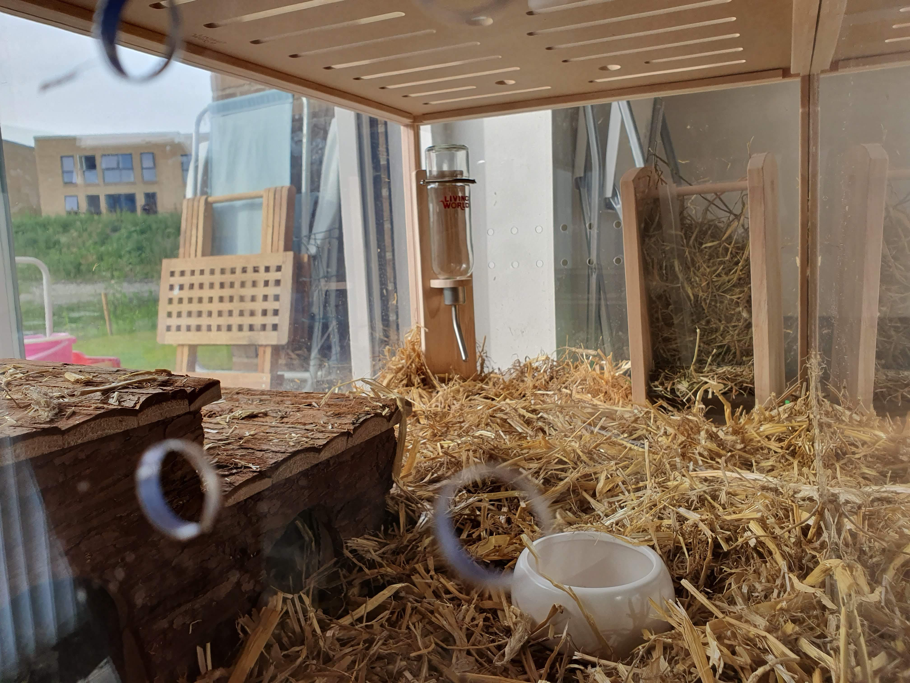

## Ankomsten af buret

Det har været rigtig rart at modtage de små ting til buret. Men ikke desto mindre var det fedeste at modtage selve buret.
Vi skyndte os alle tre at rive kassen op og se på de dele vi havde købt.

Til vores store glæde var buret faktisk meget større end vi havde gået at bildt os selv ind, så vi er ikke i tvivl om at Trøffel og Melle får det rigtig godt derinde.
Efter at det blev samlet skar vi en affaldssæk op og lagde den i bunden af buret. Rammen er lavet af træ, så vi vil helst ikke have at det bliver vådt.
Derefter skulle der bundstrøelse i. Vi stræber efter at leve grønt, derfor er vores bundstrøelse genanvendt papir.

## Halm og hygge

Selvom det var en stor tilfredsstillelse at samle buret, var det sjoveste nu at sætte tingene derind. Jeg havde en plan om at huset skulle stå direkte på strøelsen, således hamlet kunne ligges inde i
huset og rundt om, som et lille fundament.

## Slutposition af buret

Hele ideen med disse marsvin var at jeg skulle have lidt liv på mit kontor. Derfor glædede det os alle at deres bur passede præcis ind i det hul som de var tiltænkt.
Nu mangler vi blot Trøffel og Melle.

